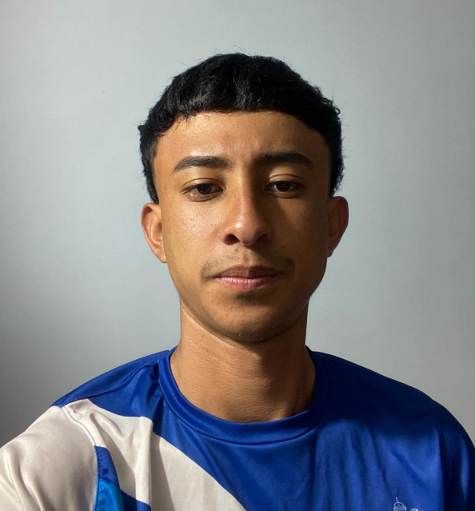
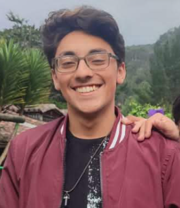

# Grupo: La princesa y los sapos

# Índice
- [Creadores](#Creadores)
- [LinkVideo](#LinkVideo)

## Creadores
* Nicolas Alberto Pedraza Vasquez

Estudiante de ingenieria electronica e ingenieria de sistemas enfocado en las areas de 
inteligencia artificial, procesamiento de datos y desarrollo web.

* Mariana Perez Casallas

  
Estudiante de ingenieria de sistemas iniciando el enfoque en la seguridad informatica y el desarrollo web

* Daniel Bohorquez

Estudiante de Ingeniería de Sistemas con enfoque en inteligencia artificial, 
procesamiento de datos, desarrollo web y programación de motores gráficos para videojuegos.

## LinkVideo
